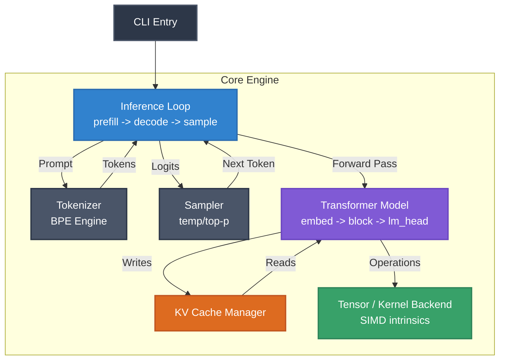

# plow

A fast, lightweight, and highly portable Large Language Model (LLM) inference engine built entirely from scratch in Rust. It runs advanced transformer models locally on consumer hardware—completely bypassing heavy Python environments, PyTorch dependencies, and opaque third-party C++ runtimes.

## Why I Built This
Open-weight models (like Llama, Qwen, and Mixtral) ship with raw weights and an architecture description, but lack a transparent runtime you actually understand. The common alternatives are either a heavy Python/PyTorch stack or a massive C++ codebase (e.g. `llama.cpp`) that you use as a black box. 

**`plow` is my solution to own the full machine learning stack.** From reading raw weight files on disk to streaming generated tokens on the screen, this project allowed me to deeply understand systems programming, low-level memory management, and applied ML engineering.

## Tech Stack
- **Core Language:** Rust (chosen for memory safety and zero-cost abstractions).
- **Tensor Operations:** Hand-written, SIMD-accelerated (AVX2/NEON) math kernels (no heavy ML frameworks used).
- **Model Parsing:** `safetensors` for zero-copy memory-mapped loading.
- **Tokenization:** `tokenizers` (HuggingFace BPE).
- **CLI Framework:** `clap`.

## System Architecture

The engine is built around a highly optimized inference loop that manages the token prefill, decode, and sampling stages sequentially.



## Key Technical Achievements

- **Zero-Dependency Inference Loop:** Programmed the entire forward pass mathematics from scratch in Rust. This includes RMSNorm, Rotary Positional Embeddings (RoPE), Grouped-Query Attention (GQA), and SwiGLU MLPs.
- **Custom KV Cache Manager:** Engineered a pre-allocated, contiguous Key-Value cache mapping `[n_layers][max_seq_len, n_kv_heads, head_dim]`. This ensures real-time, O(1) memory allocation during token decoding, resulting in ultra-low latency streaming.
- **Quantization Support:** Implemented custom Q8_0 (symmetric int8) and Q4_K memory quantization schemes. Built fused dequantize-and-matmul kernels to process blocks on-the-fly without ever materializing full fp32 matrices in RAM.
- **Zero-Copy Loading:** Utilized memory-mapped files (mmap) via the `safetensors` format to load gigabytes of model weights instantly into memory with near-zero RAM overhead.
- **Mathematical Correctness First:** Validated all operations via strict unit testing against HuggingFace Transformers, achieving mathematically identical outputs (cosine similarity > 0.999) before applying aggressive SIMD optimizations.

## Getting Started

### Requirements
- Rust toolchain (`cargo`), tested on Linux/macOS.

### 1. Build the Engine
Compile the engine using Rust's package manager for maximum optimization:
```bash
cargo build --release
```

### 2. Run a Model
Download a standard open-weight `.safetensors` model, then use the CLI to prompt the engine and stream tokens directly to your terminal:
```bash
./target/release/plow run --model ./llama3-8b.safetensors --prompt "Explain the importance of memory safety in systems programming."
```

### 3. Quantize a Model
To run larger models on constrained hardware, you can quantize them to 4-bit representation:
```bash
./target/release/plow quantize --input ./model.safetensors --output ./model-q4.safetensors --scheme q4_k
```

### 4. Run the Web Interface (Demo)
A beautiful, glassmorphism Next.js web interface is included for live demonstrations. It directly streams tokens from the C++ inference engine using Server-Sent Events (SSE).

```bash
cd ui
npm install
npm run dev
```
Navigate to `http://localhost:3000` to interact with the model.

## License
MIT License.

